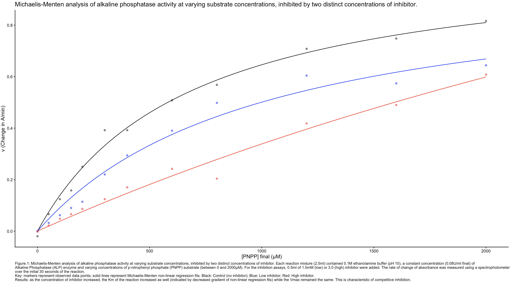

# Alkaline Phosphatase Enzyme Kinetics & Competitive Inhibition Analysis

This repository contains the R script, datasets, and visualizations used to perform non-linear regression modeling for Alkaline Phosphatase (ALP) activity under varying substrate and inhibitor conditions.

## Project Overview
The analysis models the rate of change of absorbance via spectrophotometry over the initial 30 seconds of the reaction to evaluate enzyme velocity ($V_{max}$) and the Michaelis constant ($K_m$) across three experimental conditions.

### Experimental Parameters
*   **Reaction Volume:** 2.5ml
*   **Buffer:** 0.1M ethanolamine buffer (pH 10)
*   **Enzyme Concentration:** Constant 0.08U/ml final Alkaline Phosphatase (ALP)
*   **Substrate:** Varying concentrations of p-nitrophenyl phosphate (PNPP) between 0 and 2000μM

## Data Visualization & Regression Output
Below is the final non-linear regression plot generated by the R script:

***

### Figure 1: Michaelis-Menten Analysis & Visual Legend
**Figure.1:** Michaelis-Menten analysis of alkaline phosphatase activity at varying substrate concentrations, inhibited by two distinct concentrations of inhibitor. Each reaction mixture (2.5ml) contained 0.1M ethanolamine buffer (pH 10), a constant concentration (0.08U/ml final) of Alkaline Phosphatase (ALP) enzyme and varying concentrations of p-nitrophenyl phosphate (PNPP) substrate (between 0 and 2000μM). For the inhibition assays, 0.5ml of 1.5mM (low) or 3.0 (high) inhibitor were added. The rate of change of absorbance was measured using a spectrophotometer over the initial 30 seconds of the reaction.

*   **Key:** Markers represent observed data points; solid lines represent Michaelis-Menten non-linear regression fits. 
*   **Black:** Control (no inhibitor)
*   **Blue:** Low inhibitor
*   **Red:** High inhibitor

**Results & Biological Insights:** As the concentration of inhibitor increased, the $K_m$ of the reaction increased as well (indicated by the decreased initial gradient of the non-linear regression fits) while the $V_{max}$ remained the same. This behavior is mathematically and physiologically characteristic of **competitive inhibition**.
